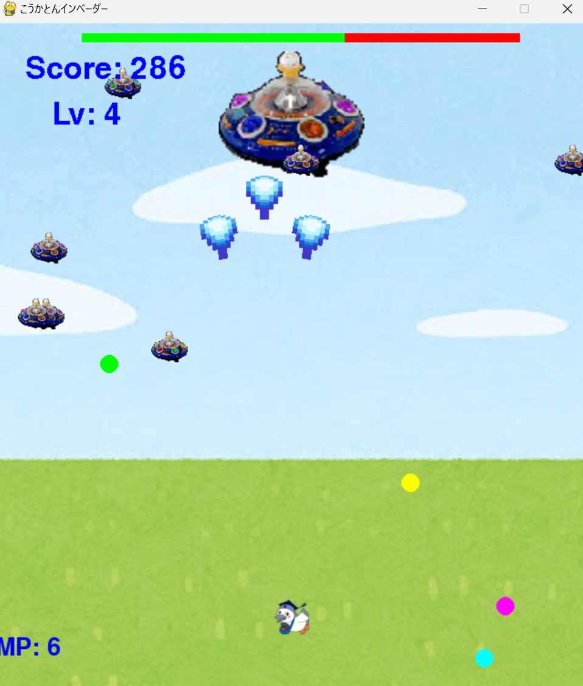

# こうかとんインベーダー

## 実行環境の必要条件
* python >= 3.10.9
* pygame >= 2.5.2

## ゲームの概要
* 主人公キャラクターこうかとんが侵略者から東京工科大学を守るゲーム
* こうかとんは通常ビームとMPを使用した強化ビームで敵を倒すことができる

## ゲームの遊び方
* ホーム画面とゲームオーバー画面は上下キーとEnterでセレクト
* ホーム画面で"左shift"を押すと名前入力モードに移行して名前を入力後"enter"で決定（名前はアルファベットのみ対応）
* rankingから過去のハイスコアを確認できる
* 左右矢印キーでこうかとんを左右に操作し，スペースキー押下によるビームで敵が落としてくる爆弾を破壊したり、敵を攻撃する
* 爆弾の破壊や敵を倒すことでスコアが加算される
* 難易度レベルは時間経過で上がっていく
* 定期的にボスが出現する
* 雑魚敵を通常攻撃で倒したときのみMPを1増やす
* "e"キーでMPを1を消費して拡散ビーム、"w"キーでMPを5を消費して爆弾貫通拡散ビーム、"q"キーでMPを7を消費して貫通拡散ビームを放つ
* こうかとんに攻撃が当たった時点でゲームオーバーとなる

## ゲームの実装
### 共通基本機能
* 背景画像と主人公キャラクターの描画
* 主人公の操作
* 仮ホーム画面・ゲームオーバー画面実装
* 雑魚敵・爆弾・ビーム実装
* 文字生成クラス実装
* 敵が時間経過で多く出現するようにするレベル機能実装

### 分担追加機能
* ハイスコアを別ファイルに記録して表示させる **佐藤**
* ランキング機能追加 **佐藤**
* 名前記録機能 **佐藤**
* ホーム画面とゲームオーバー画面のリメイク **林**
* 隠しコマンドの実装 **竹内** 
* ボス機能（HPバー追加）**梅本**
* アビリティ追加（MP概念追加） **山本**

### ToDo
- [ ] 音の追加
- [ ] 新しい敵の出現
- [ ] ステージモードの追加

### メモ
* 画面推移はflag変数で管理している
* 文字表示はFontdrawクラスを利用してください
* 各クラスの仕様の確認をしてから作業に入ってください
* 変数名について、基本的にはわかりやすく被りにくいものにしてください（できれば英語名）

* flag="rank"によりランク画面を実装しています。それによりホーム画面に新たな選択肢ができているためコードの修正をお願いします
* スコアランククラスの処理によりフォルダ内に新しいファイルが作成されますが内容を手動で書き換えると、エラーを吐くようになる可能性があるため、気を付けてください